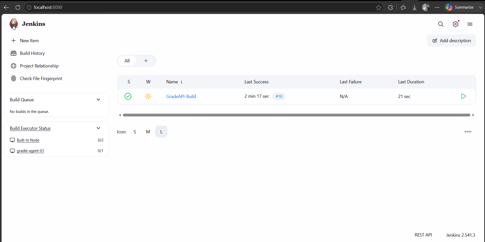

# CodeAlpha Jenkins Remoting

This repository contains a Dockerized Jenkins setup utilizing Jenkins Remoting over SSH. The architecture consists of a Jenkins Controller and an isolated Jenkins SSH Agent node (`gradle-agent-01`) dedicated to building a Gradle-based Java API.

## Architecture
- **Jenkins Controller (`jenkins-controller`)**: Runs the main Jenkins UI and orchestration. It is built from the official Jenkins LTS image and comes pre-loaded with necessary plugins (like `ssh-slaves`, `git`, `gradle`, and `blueocean`).
- **Jenkins SSH Agent (`jenkins-agent`)**: Runs the actual build workloads. It has JDK 17 and Gradle 8.5 installed and exposes port 22 internally. The Controller communicates with it via SSH using a passwordless RSA key.

## Quick Start

### 1. Start the Cluster
Run the following command from this directory to build and start the containers:
```bash
docker compose up -d --build
```

### 2. Access Jenkins
Wait a minute or two for Jenkins to fully initialize. Retrieve the initial admin password from the Controller logs:
```bash
docker logs jenkins-controller
```
Copy the password, then navigate to `http://localhost:8080` in your web browser and paste the password to unlock Jenkins.

### 3. Add SSH Credentials
1. Go to **Manage Jenkins** -> **Credentials** -> **System** -> **Global credentials (unrestricted)**.
2. Click **Add Credentials**.
3. Set **Kind** to **SSH Username with private key**.
4. Set **Username** to `jenkins`.
5. Check **Enter directly** under Private Key, and paste the contents of `./ssh-keys/jenkins_agent_key`.
6. Save the credential.

### 4. Add the Agent Node
1. Go to **Manage Jenkins** -> **Nodes** -> **New Node**.
2. Set Node Name to `gradle-agent-01` and check **Permanent Agent**.
3. Set **Remote root directory** to `/home/jenkins/workspace`.
4. Set **Labels** to `gradle`.
5. Set **Launch method** to **Launch agents via SSH**.
6. Set **Host** to `jenkins-agent`.
7. Select the credential you created in Step 3.
8. Set **Host Key Verification Strategy** to **Non-verifying Verification Strategy**.
9. Save and check the node logs. It should connect successfully!

### 5. Create the Pipeline
1. Create a new **Pipeline** job on the Jenkins dashboard.
2. Under the **Pipeline** section, choose **Pipeline script from SCM** (or just copy-paste the `Jenkinsfile` from this repository).
3. Build the pipeline and monitor the logs. You will see it successfully executing on `gradle-agent-01`.

## 📸 Output Screenshots

Here are the successful pipeline execution results:




